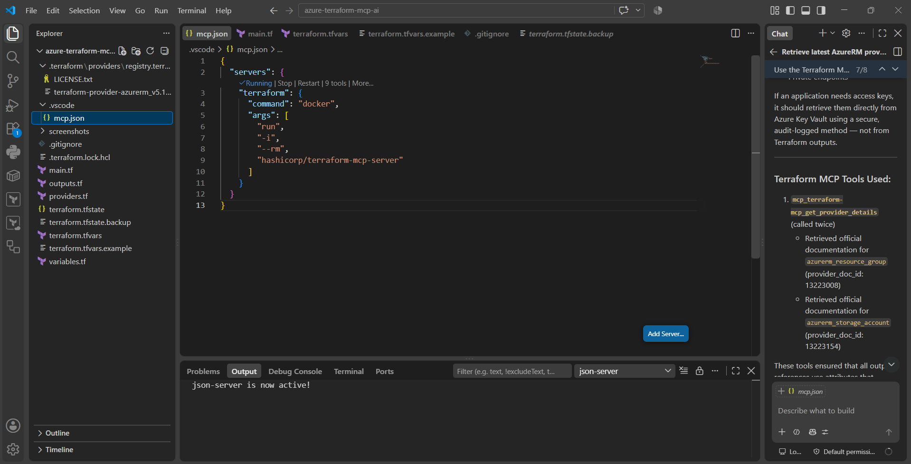
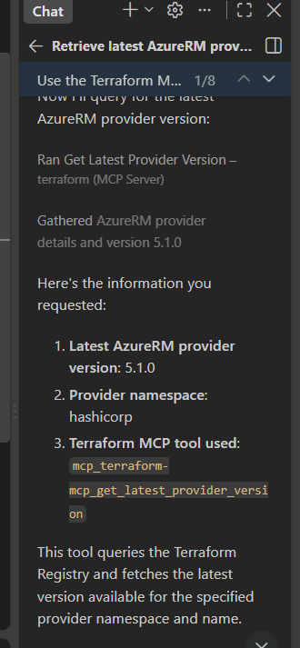
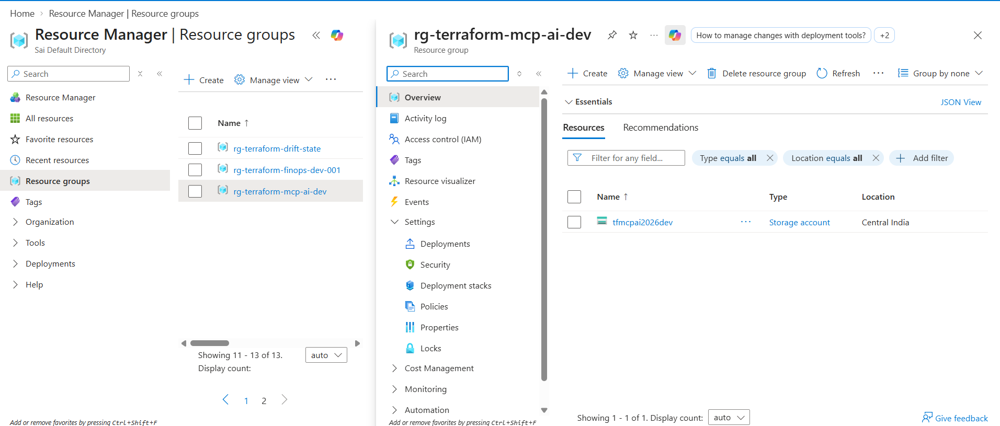

# 🤖 AI-Assisted Azure Infrastructure with Terraform MCP Server

A hands-on Infrastructure as Code project demonstrating how **Terraform MCP Server**, **GitHub Copilot Agent**, **Terraform**, and **Microsoft Azure** can work together to build, validate, deploy, detect drift, and reconcile cloud infrastructure.

---

## 🚀 Project Overview

AI coding assistants can generate Terraform configuration quickly, but their responses may depend on previously learned information.

This project explores a more context-aware workflow using the **Terraform MCP Server**.

Instead of relying only on AI model knowledge, GitHub Copilot Agent uses Terraform MCP tools to retrieve current Terraform Registry information before assisting with Infrastructure as Code.

The project demonstrates the complete lifecycle:

```text
Developer
    ↓
GitHub Copilot Agent
    ↓
Terraform MCP Server
    ↓
Terraform Registry
    ↓
AzureRM Provider Documentation
    ↓
Terraform Configuration
    ↓
terraform validate
    ↓
terraform plan
    ↓
Microsoft Azure
    ↓
Drift Detection
    ↓
Drift Remediation
```

---

# 🏗️ Architecture

```text
                    ┌─────────────────────┐
                    │      Developer      │
                    └──────────┬──────────┘
                               │
                               ▼
                    ┌─────────────────────┐
                    │ GitHub Copilot      │
                    │ Agent in VS Code    │
                    └──────────┬──────────┘
                               │
                               ▼
                    ┌─────────────────────┐
                    │ Terraform MCP       │
                    │ Server              │
                    └──────────┬──────────┘
                               │
                               ▼
                    ┌─────────────────────┐
                    │ Terraform Registry  │
                    │ AzureRM Provider    │
                    └──────────┬──────────┘
                               │
                               ▼
                    ┌─────────────────────┐
                    │ Terraform IaC       │
                    │ Configuration       │
                    └──────────┬──────────┘
                               │
                   ┌───────────┴───────────┐
                   │                       │
                   ▼                       ▼
          Azure Resource Group      Azure Storage Account
```

---

# 🛠️ Technologies Used

* Microsoft Azure
* Terraform
* HashiCorp Terraform MCP Server
* GitHub Copilot Agent
* Visual Studio Code
* Docker
* Azure CLI
* Git
* GitHub

---

# 📁 Project Structure

```text
azure-terraform-mcp-ai/
│
├── .vscode/
│   └── mcp.json
│
├── screenshots/
│   ├── 01-mcp-server-running.png
│   ├── 02-azurerm-version-mcp.png
│   ├── 03-storage-account-docs-mcp.png
│   ├── 04-terraform-plan.png
│   ├── 05-terraform-apply-success.png
│   ├── 06-drift-detection.png
│   ├── 07-azure-portal-verification.png
│   └── 08-drift-remediation-success.png
│
├── .gitignore
├── .terraform.lock.hcl
├── providers.tf
├── variables.tf
├── main.tf
├── outputs.tf
└── terraform.tfvars.example
```

---

# 🧠 Why Terraform MCP?

Normally an AI coding assistant might generate Terraform configuration using information available in its model context.

In this project, Terraform MCP adds another layer:

```text
Prompt
   ↓
GitHub Copilot
   ↓
Terraform MCP
   ↓
Terraform Registry
   ↓
Current Provider Information
   ↓
Terraform Code
```

This allows the AI assistant to retrieve Terraform provider and resource information before helping generate infrastructure configuration.

---

# 1️⃣ Terraform MCP Server Integration

Terraform MCP Server was configured inside the VS Code workspace using:

```json
{
  "servers": {
    "terraform": {
      "command": "docker",
      "args": [
        "run",
        "-i",
        "--rm",
        "hashicorp/terraform-mcp-server"
      ]
    }
  }
}
```

The MCP server successfully started and exposed Terraform tools to GitHub Copilot Agent.

![Terraform MCP Server Running]



---

# 2️⃣ Retrieve Current AzureRM Provider Information

Instead of immediately generating Terraform code, Copilot was instructed to query Terraform MCP first.

The MCP server retrieved the AzureRM provider information from the Terraform Registry.

During this project, the retrieved provider version was:

```text
hashicorp/azurerm
Version: 5.1.0
```

The MCP tool used by Copilot retrieved the current provider version from the registry.

![AzureRM Provider Lookup]




---

# 3️⃣ Retrieve Azure Storage Account Documentation

Terraform MCP was then used to search the AzureRM documentation for:

```text
azurerm_storage_account
```

The MCP server retrieved current provider documentation before Terraform configuration was generated.

![Storage Account Documentation]


This workflow demonstrates:

```text
Requirement
    ↓
MCP Documentation Lookup
    ↓
Resource Understanding
    ↓
Terraform Configuration
```

---

# 4️⃣ Terraform Configuration

The project was separated into multiple Terraform files.

## `providers.tf`

Defines the AzureRM provider.

```hcl
terraform {
  required_providers {
    azurerm = {
      source  = "hashicorp/azurerm"
      version = "~> 5.1.0"
    }
  }
}

provider "azurerm" {
  features {}
}
```

---

## `variables.tf`

Defines reusable project inputs such as:

```text
Resource Group Name
Azure Location
Storage Account Name
Storage Tier
Replication Type
Environment
```

---

## `main.tf`

Creates:

```text
Azure Resource Group
        ↓
Azure Storage Account
```

The Storage Account references the Resource Group directly:

```hcl
resource_group_name = azurerm_resource_group.main.name
location            = azurerm_resource_group.main.location
```

This creates an implicit Terraform dependency between the resources.

---

## `outputs.tf`

Returns useful infrastructure information such as:

```text
Resource Group ID
Resource Group Name
Storage Account ID
Storage Account Name
Primary Blob Endpoint
```

No credentials, passwords, connection strings, or access keys are exposed through outputs.

---

# 🔐 Security Configuration

The Storage Account configuration includes settings such as:

```hcl
account_kind                    = "StorageV2"
https_traffic_only_enabled      = true
min_tls_version                 = "TLS1_2"
allow_nested_items_to_be_public = false
```

The project intentionally avoids hardcoded Azure credentials or secrets.

---

# 5️⃣ Terraform Validation Workflow

Before deploying anything to Azure, the configuration was checked using:

```bash
terraform fmt
terraform init
terraform validate
terraform plan
```

The initial Terraform plan returned:

```text
Plan: 2 to add, 0 to change, 0 to destroy.
```

The two resources were:

```text
azurerm_resource_group.main
azurerm_storage_account.main
```

![Terraform Plan]


---

# 6️⃣ Azure Deployment

After reviewing the Terraform plan, the infrastructure was deployed.

```bash
terraform apply
```

Terraform successfully created both resources:

```text
Apply complete!

Resources:
2 added
0 changed
0 destroyed
```

![Terraform Apply Success]


---

# ☁️ Azure Portal Verification

The deployed infrastructure was verified directly from Microsoft Azure.

Created Resource Group:

```text
rg-terraform-mcp-ai-dev
```

Created Storage Account:

```text
tfmcpai2026dev
```

Region:

```text
Central India
```

![Azure Portal Verification]



---

# 🔄 Terraform State

Terraform tracks the deployed resources through its state.

The managed resources were verified using:

```bash
terraform state list
```

Example:

```text
azurerm_resource_group.main
azurerm_storage_account.main
```

Terraform state provides the mapping between Terraform resource addresses and the real Azure resources.

---

# ⚠️ Configuration Drift Simulation

To simulate a real-world operational scenario, an additional tag was manually added to the Azure Storage Account outside Terraform:

```text
DriftTest = ManualChange
```

The Terraform configuration did not contain this tag.

This created:

```text
Terraform Desired State
          ≠
Actual Azure State
```

A new Terraform plan detected the difference.

```text
DriftTest = "ManualChange" -> null
```

Terraform proposed:

```text
Plan: 0 to add, 1 to change, 0 to destroy.
```

![Terraform Drift Detection]


---

# 🛠️ Drift Remediation

Because the manual change was considered unwanted, the Terraform configuration was intentionally left unchanged.

A remediation plan was saved:

```bash
terraform plan -out=drift-fix.tfplan
```

The saved plan was then applied:

```bash
terraform apply drift-fix.tfplan
```

Terraform updated the existing Storage Account without recreating it.

```text
Apply complete!

Resources:
0 added
1 changed
0 destroyed
```

The manually introduced tag was removed.

A final verification was performed:

```bash
terraform plan
```

Result:

```text
No changes.
Your infrastructure matches the configuration.
```

![Terraform Drift Remediation]


---

# 🔄 Drift Management Decision

A key lesson from this project is that detected drift does not always mean Terraform should automatically overwrite the change.

Two possible scenarios exist.

### Manual change is NOT approved

Keep the Terraform configuration unchanged.

```text
terraform plan
       ↓
Review drift
       ↓
terraform apply
       ↓
Restore declared configuration
```

### Manual change IS approved

Update Terraform configuration to include the approved change.

```text
Azure manual change
       ↓
Team approval
       ↓
Update Terraform code
       ↓
terraform plan
       ↓
Infrastructure and code synchronized
```

This preserves Terraform as the Infrastructure as Code source of truth.

---

# 🧹 Infrastructure Cleanup

For learning environments, resources should be removed after testing to avoid unnecessary Azure costs.

A destroy plan can be reviewed first:

```bash
terraform plan -destroy -out=destroy.tfplan
```

Then executed:

```bash
terraform apply destroy.tfplan
```

---

# 🔒 Repository Security

The following files are intentionally excluded from Git:

```text
.terraform/
terraform.tfstate
terraform.tfstate.backup
terraform.tfvars
*.tfplan
```

A safe example variable file is provided instead:

```text
terraform.tfvars.example
```

Users can copy it locally:

```powershell
Copy-Item terraform.tfvars.example terraform.tfvars
```

and provide their own values.

---

# 💡 Key Learning Outcomes

This project helped demonstrate practical understanding of:

* Infrastructure as Code with Terraform
* Azure Resource provisioning
* Terraform MCP Server integration
* AI-assisted Terraform development
* Terraform Registry documentation lookup
* AzureRM provider usage
* Terraform variables and outputs
* Terraform state management
* Resource dependencies
* Terraform plan review
* Configuration drift detection
* Drift remediation
* Infrastructure reconciliation
* Secure GitHub practices
* Complete infrastructure lifecycle management

---

# 🎯 Project Workflow

```text
Terraform MCP Setup
       ↓
AzureRM Provider Lookup
       ↓
Resource Documentation Lookup
       ↓
AI-Assisted Terraform Development
       ↓
terraform fmt
       ↓
terraform init
       ↓
terraform validate
       ↓
terraform plan
       ↓
Azure Deployment
       ↓
Azure Verification
       ↓
Manual Drift
       ↓
Drift Detection
       ↓
Drift Remediation
       ↓
Final terraform plan
       ↓
No Changes ✅
```

---

# 🚀 Final Result

This project demonstrates that AI-assisted Infrastructure as Code can be more useful when the AI assistant has access to relevant Terraform context through MCP.

Rather than treating AI-generated Terraform as automatically correct, the workflow follows:

```text
AI Assistance
     +
Current Terraform Context
     +
Engineer Review
     +
Terraform Validation
     +
Plan Before Apply
```

The engineer remains responsible for reviewing infrastructure changes, validating security and cost implications, and approving deployment.

---

## ⭐ If you found this project useful

Feel free to explore the Terraform configuration and project workflow.

Contributions, feedback, and suggestions are welcome.
