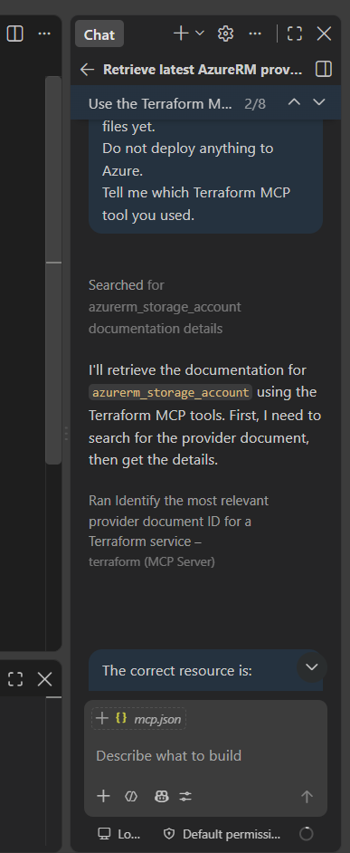
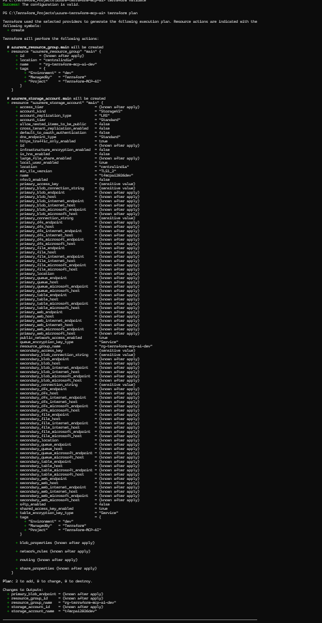
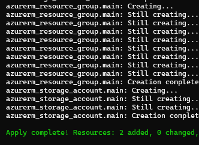
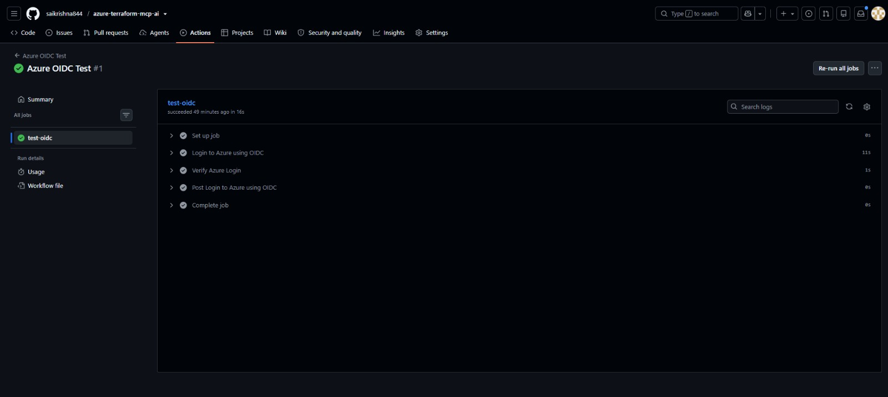
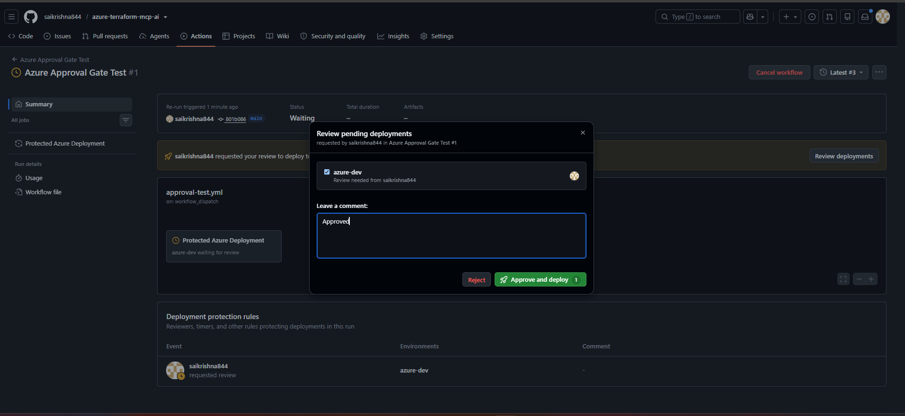
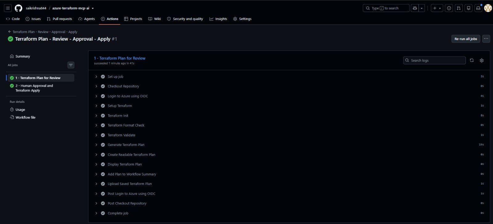
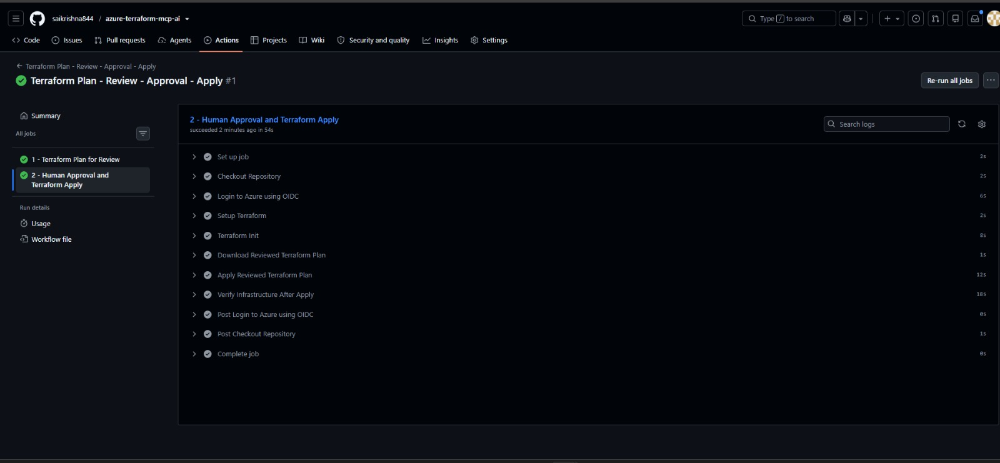
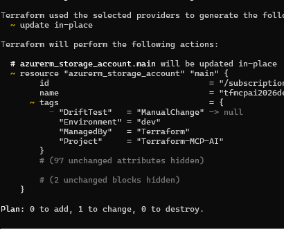
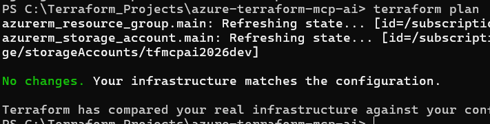

## AI-Assisted Azure Infrastructure with Terraform MCP, GitHub Copilot & Human Approval Gates

Context-aware Infrastructure as Code with Terraform MCP, Azure, GitHub OIDC, remote state, drift detection, and a real human approval gate before terraform apply.

🚀 Project Overview

AI can generate Terraform code quickly.

But for infrastructure, speed is not enough.

This project explores a safer and more practical workflow where GitHub Copilot Agent can use the HashiCorp Terraform MCP Server to retrieve Terraform-specific provider and resource context before assisting with Infrastructure as Code.

The project then goes beyond code generation by implementing the complete Terraform lifecycle:

```
Developer Requirement
        ↓
GitHub Copilot Agent
        ↓
Terraform MCP Server
        ↓
Terraform Registry / AzureRM Context
        ↓
Terraform Configuration
        ↓
terraform fmt
        ↓
terraform init
        ↓
terraform validate
        ↓
terraform plan
        ↓
Human Plan Review
        ↓
🛑 GitHub Environment Approval Gate
        ↓
terraform apply <reviewed-plan>
        ↓
Microsoft Azure
        ↓
Drift Detection
        ↓
Engineer Decision
        ↓
Drift Remediation
        ↓
terraform plan
        ↓
No Changes ✅
```
The key principle behind the project is simple:

AI can assist. MCP can provide better context. Terraform can automate infrastructure. But engineering judgment still matters.

✨ What Makes This Project Different?

This is not just a basic Terraform deployment.

It demonstrates:

🤖 AI-assisted Terraform development with GitHub Copilot Agent

🔌 Terraform MCP Server integration

📚 AzureRM provider and resource-context retrieval

☁️ Azure Resource Group and Storage Account deployment

🧩 Terraform variables, outputs, and implicit dependencies

🔐 Secure GitHub repository practices

🗄️ Azure remote backend for Terraform state

🔑 GitHub Actions → Azure authentication using OIDC

🚫 No long-lived Azure client secret in GitHub

📋 Terraform plan generation before deployment

👀 Manual review of the Terraform plan

🛑 Protected GitHub Environment approval gate

✅ Apply only after explicit human approval

💾 Apply of the exact saved Terraform plan

🔥 Intentional configuration drift testing

🔄 Drift detection and remediation

🎯 Final reconciliation verification with No changes

🏗️ Architecture

```

┌──────────────────────────────┐
│        Developer / VS Code   │
└──────────────┬───────────────┘
               │
               ▼
┌──────────────────────────────┐
│    GitHub Copilot Agent      │
└──────────────┬───────────────┘
               │
               ▼
┌──────────────────────────────┐
│ HashiCorp Terraform MCP      │
│ Server                       │
└──────────────┬───────────────┘
               │
               ▼
┌──────────────────────────────┐
│ Terraform Registry /         │
│ AzureRM Provider Context     │
└──────────────┬───────────────┘
               │
               ▼
┌──────────────────────────────┐
│ Terraform Configuration      │
│ providers.tf                 │
│ variables.tf                 │
│ main.tf                      │
│ outputs.tf                   │
└──────────────┬───────────────┘
               │
               ▼
┌──────────────────────────────┐
│ GitHub Actions               │
│ fmt → init → validate → plan │
└──────────────┬───────────────┘
               │
               ▼
┌──────────────────────────────┐
│ Human Reviews Terraform Plan │
└──────────────┬───────────────┘
               │
               ▼
┌──────────────────────────────┐
│ 🛑 azure-dev Approval Gate   │
│ Approve / Reject             │
└──────────────┬───────────────┘
               │ Approved
               ▼
┌──────────────────────────────┐
│ Apply Exact Saved tfplan     │
└──────────────┬───────────────┘
               │
               ▼
┌──────────────────────────────┐
│ Microsoft Azure              │
│ Resource Group               │
│ Storage Account              │
└──────────────────────────────┘

Terraform State:
GitHub Actions / Local Terraform
               │
               ▼
Azure Storage Account
               │
               ▼
tfstate container
               │
               ▼
azure-terraform-mcp-ai-dev.tfstate
```
🧰 Technology Stack

Technology

Purpose

Terraform

Infrastructure as Code and lifecycle management

HashiCorp Terraform MCP Server

Terraform/provider context for the AI assistant

GitHub Copilot Agent

AI-assisted research and development

Microsoft Azure

Target cloud platform

AzureRM Provider

Azure resource management

Azure Storage Backend

Remote Terraform state

GitHub Actions

Automation workflow

GitHub Environments

Human approval gate

GitHub OIDC

Secretless Azure authentication

Microsoft Entra ID

Federated identity trust

Azure RBAC

Scoped authorization

Docker

Runs Terraform MCP Server locally

VS Code

Development environment

📁 Repository Structure
```
azure-terraform-mcp-ai/
│
├── .github/
│   └── workflows/
│       ├── oidc-test.yml
│       ├── approval-test.yml
│       └── terraform-approval.yml
│
├── .vscode/
│   └── mcp.json
│
├── screenshots/
│   ├── 01-mcp-server-running.png
│   ├── 02-azurerm-version-mcp.png
│   ├── 03-storage-account-docs-mcp.png
│   ├── 04-terraform-plan.png
│   ├── 05-terraform-apply-success.png
│   ├── 06-drift-detection.png
│   ├── 07-azure-portal-verification.png
│   ├── 08-drift-remediation-success.png
│   ├── 09-human-approval-gate.png
│   ├── 10-approval-gate-passed-oidc.png
│   └── 11-terraform-plan-approval-apply-success.png
│
├── .gitignore
├── .terraform.lock.hcl
├── backend.tf
├── main.tf
├── outputs.tf
├── providers.tf
├── terraform.tfvars.example
├── variables.tf
└── README.md
```
terraform.tfvars, local state files, saved plan files, and local backups are intentionally excluded from Git.

1️⃣ Terraform MCP Server Integration

The Terraform MCP Server is configured in VS Code and executed through Docker.

Example .vscode/mcp.json:

{
  "servers": {
    "terraform": {
      "command": "docker",
      "args": [
        "run",
        "-i",
        "--rm",
        "hashicorp/terraform-mcp-server"
      ]
    }
  }
}

This enables GitHub Copilot Agent to use Terraform-specific MCP tools and retrieve provider/resource information before helping with configuration.


2️⃣ AzureRM Provider Context

Before writing the Azure infrastructure, the AI-assisted workflow retrieved AzureRM provider information through Terraform MCP.

During the lab, the provider context included:

hashicorp/azurerm
AzureRM 5.1.0


The goal was to move from:

Prompt → AI → Terraform Code

toward:
```
Requirement
    ↓
AI Agent
    ↓
Terraform MCP
    ↓
Provider / Resource Context
    ↓
Terraform Configuration
    ↓
Engineer Review
```
Key idea

Context before code.

3️⃣ Resource Documentation Through MCP

Terraform MCP was also used to retrieve context for:

azurerm_storage_account

The retrieved information covered areas such as:

required arguments

optional arguments

storage configuration

networking options

identity options

security-related properties

exported attributes




4️⃣ Azure Infrastructure

The actual Azure architecture is intentionally simple:

Azure Resource Group
        ↓
Azure Storage Account

The purpose is not to deploy many services.

The purpose is to demonstrate the complete AI-assisted Terraform lifecycle with governance controls.

The Terraform configuration creates:

Resource Group:
rg-terraform-mcp-ai-dev

Storage Account:
tfmcpai2026dev

Region:
Central India

Example resource dependency:

resource_group_name = azurerm_resource_group.main.name
location            = azurerm_resource_group.main.location

Terraform automatically understands that the Storage Account depends on the Resource Group.

No unnecessary explicit depends_on is required.

5️⃣ Security-Focused Storage Configuration

The Storage Account includes configuration such as:

account_kind                    = "StorageV2"
https_traffic_only_enabled      = true
min_tls_version                 = "TLS1_2"
allow_nested_items_to_be_public = false

Environment-specific values are passed through variables instead of being hardcoded directly into resource definitions.

6️⃣ Terraform Validation and Plan

The standard local workflow is:

terraform fmt
terraform init
terraform validate
terraform plan

Initial deployment plan:

Plan: 2 to add, 0 to change, 0 to destroy.




The rule followed throughout the project is:

Generate the plan. Review the plan. Understand the impact. Then apply.

7️⃣ Successful Azure Deployment

After reviewing the initial plan, Terraform created:

✅ Azure Resource Group

✅ Azure Storage Account

Result:

Apply complete!

Resources:
2 added
0 changed
0 destroyed



Terraform outputs include useful values such as:

resource_group_name
resource_group_id
storage_account_name
storage_account_id
primary_blob_endpoint

A simple way to remember:

Variables → values going INTO Terraform

Outputs   → useful values coming OUT of Terraform

8️⃣ Azure Portal Verification

After deployment, the resources were verified directly in Microsoft Azure.


The first lifecycle was therefore:
```
Terraform Code
      ↓
Validate
      ↓
Plan
      ↓
Review
      ↓
Apply
      ↓
Azure
      ↓
Verify
```
9️⃣ Azure Remote Terraform State

The project was later improved by migrating local Terraform state to an Azure remote backend.

The backend architecture is:
```
Terraform CLI / GitHub Actions
        ↓
AzureRM Backend
        ↓
Azure Storage Account
        ↓
tfstate container
        ↓
azure-terraform-mcp-ai-dev.tfstate
```
Example backend.tf structure:

terraform {
  backend "azurerm" {
    use_cli          = true
    use_azuread_auth = true

    storage_account_name = "<your-tfstate-storage-account>"
    container_name       = "tfstate"
    key                  = "azure-terraform-mcp-ai-dev.tfstate"
  }
}

The existing local state was migrated using:

terraform init -migrate-state

After migration:

terraform state list
terraform plan

confirmed that the existing Azure resources remained mapped correctly and no recreation was required.

🔟 GitHub → Azure Authentication with OIDC

A major security improvement was replacing long-lived Azure secrets with GitHub OIDC authentication.

The authentication flow is:
```
GitHub Actions
      ↓
OIDC Token
      ↓
Microsoft Entra ID
      ↓
Federated Credential
      ↓
Service Principal
      ↓
Azure RBAC
      ↓
Azure
```
Repository secrets used:

AZURE_CLIENT_ID
AZURE_TENANT_ID
AZURE_SUBSCRIPTION_ID

There is intentionally no AZURE_CLIENT_SECRET.

The OIDC test workflow verifies the connection using:

permissions:
  id-token: write
  contents: read

and:

- name: Login to Azure using OIDC
  uses: azure/login@v3

The OIDC test completed successfully.




1️⃣1️⃣ Human Approval Gate

This is the most important governance improvement in the project.

Instead of relying on a prompt such as:

"Do not apply until a human approves."

the deployment workflow itself technically enforces approval.

A protected GitHub Environment named:

azure-dev

requires a reviewer before the Apply job can start.



The reviewer can choose:

Approve and deploy ✅

or:

Reject ❌

If rejected, Terraform Apply never starts. 


### Approval Audit Trail

After approval, GitHub records the deployment protection decision, including the reviewer, protected environment, and approval comment.


1️⃣2️⃣ OIDC After Human Approval

The protected deployment job uses an environment-specific OIDC identity.

The workflow waits first:
```
Terraform Plan
      ↓
Human Review
      ↓
🛑 azure-dev Approval Gate

Only after approval does the protected job continue:

Approval
      ↓
GitHub OIDC
      ↓
Azure Login
      ↓
Terraform Apply
```


This demonstrates that approval is not simply informational—it controls whether the Azure deployment stage can execute.

1️⃣3️⃣ Real Terraform Plan → Review → Approval → Apply Workflow

The final GitHub Actions workflow implements two jobs.

Job 1 — Terraform Plan
```
Checkout
    ↓
Azure OIDC Login
    ↓
Terraform Setup
    ↓
terraform init
    ↓
terraform fmt -check
    ↓
terraform validate
    ↓
terraform plan -out=tfplan
    ↓
terraform show tfplan
    ↓
Readable Plan
    ↓
Upload Saved Plan
```


The Terraform plan is also added to the GitHub workflow summary so the reviewer can inspect the proposed infrastructure changes.

Job 2 — Protected Terraform Apply
```
Plan Job Completed
      ↓
🛑 azure-dev Approval Gate
      ↓
Reviewer Checks Plan
      ↓
Approve / Reject
      ↓
Download SAME tfplan
      ↓
terraform apply tfplan
      ↓
Final terraform plan
```


Why the saved plan matters

The workflow creates:

terraform plan -out=tfplan

The reviewer inspects the plan.

After approval, Terraform executes:

terraform apply tfplan

This preserves the relationship between what was reviewed and what is applied.

1️⃣4️⃣ Configuration Drift Testing

To simulate a realistic infrastructure issue, a manual Azure change was introduced.

A tag was added directly in the Azure portal:

DriftTest = ManualChange

Terraform configuration did not contain this value.

Now:

Terraform Desired State
          ≠
Actual Azure State

Terraform detected the drift:

DriftTest = "ManualChange" -> null

and proposed:

Plan: 0 to add, 1 to change, 0 to destroy.



The 0 to destroy result is important because Terraform can reconcile the Storage Account in place.

1️⃣5️⃣ Drift Detection Is Only Half the Problem

Detecting drift does not automatically tell the engineer what the correct business decision is.

The engineer must decide:

Should we keep the manual change or remove it?

Scenario A — Manual change was accidental
```
Keep Terraform code unchanged
        ↓
terraform plan
        ↓
Review remediation
        ↓
Human approval
        ↓
terraform apply reviewed-plan
        ↓
Azure returns to declared state
```
Scenario B — Manual change was approved

The approved change should be added to the Terraform configuration.

Example:

tags = {
  Environment = var.environment
  ManagedBy   = "Terraform"
  Project     = "Terraform-MCP-AI"
  DriftTest   = "ManualChange"
}

If Azure and Terraform configuration now agree:

No changes.

Core lesson

Drift detection tells us something changed. Engineering judgment determines whether that change should be accepted or reverted.

1️⃣6️⃣ Drift Remediation

For the project test, the manually added drift was treated as unwanted.

A saved remediation plan was created:

terraform plan -out=drift-fix.tfplan

Terraform proposed:

0 to add
1 to change
0 to destroy




The reviewed plan was applied:

terraform apply drift-fix.tfplan

Result:

Apply complete!

Resources:
0 added
1 changed
0 destroyed

Final verification:

terraform plan

returned:

No changes.
Your infrastructure matches the configuration.


1️⃣7️⃣ What Terraform MCP Did — and What It Did Not Do

This distinction is important.

Terraform MCP did not deploy Azure resources.

The responsibilities are:

Terraform MCP
      ↓
Terraform / provider context

```
GitHub Copilot Agent
      ↓
AI-assisted research and development
```

```
Terraform
  ↓
Format
Init
Validate
State
Plan
Apply
Drift Detection
Reconciliation


GitHub Actions
      ↓
Automation


GitHub Environment
      ↓
Human approval enforcement


Microsoft Azure
      ↓
Actual infrastructure
```
Terraform MCP improves the context available to the AI assistant.

Terraform remains responsible for infrastructure lifecycle management.

The engineer remains responsible for validation, security, plan review, cost awareness, approvals, and deployment decisions.

1️⃣8️⃣ GitHub Security Practices

The repository excludes local or potentially sensitive Terraform artifacts.

Example .gitignore entries:

.terraform/

*.tfstate
*.tfstate.*

*.tfplan
tfplan

terraform.tfvars
*.auto.tfvars

local-state-backup.json

crash.log
crash.*.log

.terraformrc
terraform.rc

override.tf
override.tf.json
*_override.tf
*_override.tf.json

.DS_Store
Thumbs.db

The repository keeps:

.terraform.lock.hcl

committed.

Instead of committing a real terraform.tfvars, the repository provides:

terraform.tfvars.example

The project avoids publishing:

❌ Azure credentials

❌ client secrets

❌ storage access keys

❌ connection strings

❌ Terraform state

❌ saved Terraform plans

❌ local state backups

1️⃣9️⃣ Example Variables

Example terraform.tfvars.example:

resource_group_name      = "rg-terraform-mcp-ai-dev"
location                 = "Central India"
storage_account_name     = "replacewithuniquestoragename"
account_tier             = "Standard"
account_replication_type = "LRS"
environment              = "dev"

Copy locally:

cp terraform.tfvars.example terraform.tfvars

On Windows PowerShell:

Copy-Item terraform.tfvars.example terraform.tfvars

Then replace the Storage Account name with a globally unique value.

2️⃣0️⃣ Local Deployment Commands

terraform fmt
terraform init
terraform validate
terraform plan

To create and review a saved plan:

terraform plan -out=tfplan
terraform show tfplan

To apply the reviewed saved plan:

terraform apply tfplan

To inspect state:

terraform state list

To verify reconciliation:

terraform plan

Expected healthy result:

No changes.
Your infrastructure matches the configuration.

2️⃣1️⃣ GitHub Actions Workflow

The final deployment workflow is located at:

.github/workflows/terraform-approval.yml

It implements:
```
Terraform Plan
      ↓
Readable Plan
      ↓
Saved Plan Artifact
      ↓
Manual Reviewer Inspection
      ↓
🛑 GitHub Environment Approval
      ↓
OIDC Authentication
      ↓
Apply Exact Saved Plan
      ↓
Final Verification
```
This is the governance control added to ensure that Terraform Apply cannot proceed without explicit human approval.

2️⃣2️⃣ RBAC Design

The GitHub federated identity is intentionally scoped rather than given broad unrestricted access.

Conceptually:
```
GitHub OIDC Service Principal
        │
        ├── Contributor
        │      ↓
        │   Application Resource Group
        │
        └── Storage Blob Data Contributor
               ↓
            Terraform State Storage
```
This separates:

Infrastructure permissions

from:

Terraform state data access

2️⃣3️⃣ Key Engineering Lessons

1. Context before code

AI-generated infrastructure becomes more useful when the assistant can retrieve relevant Terraform/provider context.

2. Plan before Apply

A Terraform plan should be reviewed before infrastructure changes are allowed.

3. Approval should be enforced by the workflow

A prompt asking AI not to deploy is not the same as a technical deployment control.

4. OIDC is better than long-lived cloud secrets

GitHub Actions can authenticate to Azure using federated identity instead of storing a reusable Azure client secret.

5. Remote state enables automation

GitHub-hosted runners cannot depend on a developer laptop's local terraform.tfstate.

6. Drift requires judgment

Terraform can detect drift, but humans still decide whether an external change should be accepted or reverted.

7. Review the exact plan that will be applied

Saving the plan helps preserve the connection between human review and infrastructure execution.

🎯 Final End-to-End Workflow
```
Developer Requirement
        ↓
GitHub Copilot Agent
        ↓
Terraform MCP Server
        ↓
Terraform Registry
        ↓
AzureRM Provider / Resource Context
        ↓
Terraform Configuration
        ↓
GitHub Actions
        ↓
Azure OIDC Authentication
        ↓
terraform init
        ↓
terraform fmt -check
        ↓
terraform validate
        ↓
terraform plan -out=tfplan
        ↓
Readable Plan Generated
        ↓
👀 ENGINEER REVIEWS PLAN
        ↓
🛑 GITHUB ENVIRONMENT APPROVAL GATE
        ↓
      Decision
      /      \
Approve    Reject
   ↓          ↓
Apply       STOP
   ↓
Download Exact Saved tfplan
   ↓
terraform apply tfplan
   ↓
Microsoft Azure
   ↓
Drift Detection
   ↓
Engineer Decision
   ↓
Approved Remediation
   ↓
terraform plan
   ↓
No Changes ✅
```
💡 Biggest Takeaway

The goal is not to let AI control infrastructure. The goal is to use AI and MCP to improve engineering context while keeping Terraform lifecycle controls, identity, security, plan review, and deployment approval firmly governed.

AI can assist.

MCP can provide better context.

Terraform can automate infrastructure.

GitHub can enforce approval.

But engineering judgment remains the final control.

🔮 Future Enhancements

Potential next improvements:

Terraform reusable modules

dev / test / prod environments

PR-based Terraform plan comments

branch protection and mandatory PR reviews

policy-as-code checks

Checkov or tfsec security scanning

cost estimation before approval

remote-state security hardening

dedicated identities per environment

production environment with separate reviewers

automated drift-detection workflow

scheduled compliance checks

🤝 Discussion

For Cloud, DevOps, Platform, and Infrastructure engineers:

How far should AI-assisted Infrastructure as Code go before mandatory human approval becomes non-negotiable?

And:

Would you allow an AI-assisted Terraform workflow to reach apply without a protected approval gate in production?

🔗 Project

GitHub Repository:

https://github.com/saikrishna844/azure-terraform-mcp-ai

🏷️ Topics

Terraform · Azure · DevOps · Infrastructure as Code · HashiCorp · MCP · GitHub Copilot · GitHub Actions · OIDC · Terraform Drift · Human Approval · Cloud Governance · Platform Engineering

⭐ If you find this project useful, consider starring the repository.

Built as a hands-on exploration of AI-assisted Infrastructure as Code with real Terraform lifecycle controls.
